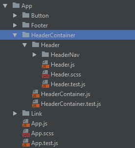

> When it comes to structuring a React app, the ideal structure is the one that allows you to move around your code with the least ammoutn of effort.
 
> The structure of the app, has nothing to do with the computers
 
To work out the 100% correct application:
- Create a new component
- Import 1 module to another
- Jump to source (A file with external reference)
- Open a known file SECOND MOST FREQUENT
- Browse for a file you dont know the name of
- Change tab to another open file MOST FREQUENT

Directory Structure (GENERAL RULE)
- If module used by only 1 other Module, keep them in the same dir
- Use fully qualified globally unique names eg. HeaderNav is inside Header.
 

 
What about container components ?
- Treat them like presentational components
- Leave out of dir structure. Only job is provide data
 

 
Self-Contained components
- Do not share css classes between components
- CSS should have its own seperate modules,
- Each component should have its own directory, css and a test file
 
File Naming
> name your files the same as the thing your exporting from that file
- https://medium.com/hackernoon/the-100-correct-way-to-structure-a-react-app-or-why-theres-no-such-thing-3ede534ef1ed
 
.js vs .jsx extensions
- Facebook recommends not using .jsx
 
Index files for utils
- Solution one: use Webpacks alias resolving to refer to utils
- Solution two: not be lazy about typing imports and keep all utils in 1 folder
 
Index files for components
```
// To do this, we use webpack and index.js
import React from 'react';
import {
  Button,
  Footer,
  Header,
  Page,
} from 'Components';

```
 
```
// Webpack config
const config = {
  // other stuff
  resolve: {
    alias: {
      'Components': path.resolve(__dirname, '../src/app/components/'),
    },
  },
};
```
 
```
// for index.js file located in component folder you export all components
export { default as Header } from './Header/Header'
```
 
N Exports per file
- 