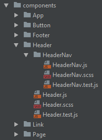

> When it comes to structuring a React app, the ideal structure is the one that allows you to move around your code with the least ammoutn of effort.
 
> The structure of the app, has nothing to do with the computers
 
To work out the 100% correct application:
- Create a new component
- Import 1 module to another
- Jump to source (A file with external reference)
- Open a known file SECOND MOST FREQUENT
- Browse for a file you dont know the name of
- Change tab to another open file MOST FREQUENT

Directory Structure (GENERAL RULE)
- If module used by only 1 other Module, keep them in the same dir
- Use fully qualified globally unique names eg. HeaderNav is inside Header.
